# FreshBite - End-to-End DevSecOps Food Delivery App

A modern, fully containerized React frontend (inspired by Zomato) with a complete DevSecOps pipeline: CI with security scans, Docker containerization, Kubernetes manifests, GitOps deployment (Argo CD), and monitoring — all deployed to AWS EKS.

Built with:
- Vite + React 18 + TypeScript + Tailwind CSS + shadcn/ui
- TanStack Query, React Hook Form, Zod, Framer Motion, Recharts, Lucide icons

## Project Highlights
- **CI/CD**: GitHub Actions with SonarCloud, OWASP Dependency-Check, Trivy (FS + image), Docker Scout
- **Containerization**: Multi-stage Dockerfile (Node build → Nginx serve)
- **Orchestration**: Kubernetes manifests + local Minikube testing
- **GitOps**: Argo CD for declarative deployments to AWS EKS
- **Monitoring**: Prometheus + Grafana (implemented)
- **Security**: Zero high/critical npm vulnerabilities after remediation; base image risk accepted

## Architecture Overview

*(High-level flow: GitHub → Actions CI → Docker Hub → Argo CD → EKS + Monitoring)*

## Phase 1 – Base App Preparation
- Cleaned Lovable.dev export
- Verified production build: `npm run build && npm run preview`
- Pushed to GitHub: https://github.com/Mani0013/devsecops-food-delivery

## Phase 2 – Containerization
- Multi-stage Dockerfile: Node 20-alpine (build) → nginx:alpine (runtime)
- Image size: ~26 MB compressed
- Pushed to Docker Hub: https://hub.docker.com/r/manideep003/freshbite

## Phase 3 – GitHub Actions CI Pipeline
Automated on push/PR to main:
- SonarCloud: Code quality & security
- OWASP Dependency-Check: Dependency vulnerabilities
- Trivy: Filesystem & image scanning
- Docker Scout: Advanced image analysis
- Build & push to Docker Hub

**Security Remediation**:
- Initial OWASP scan: 8 vulnerable deps (12 vulns, including high-severity XSS in react-router)
- Fixed via `npm audit fix` → final report: **0 vulnerabilities**

**Container Security**:
- Docker Scout detected 1 high vulnerability in base image (libpng CVE in nginx:alpine)
- Risk: Low — static file serving only; no exploitable path
- Accepted for demo (production would use distroless or patched base)

## Phase 4 – Kubernetes Manifests & Local Testing
- Created `deployment.yaml` (2 replicas) and `service.yaml` (NodePort)
- Tested locally with Minikube
- App successfully running at Minikube service URL

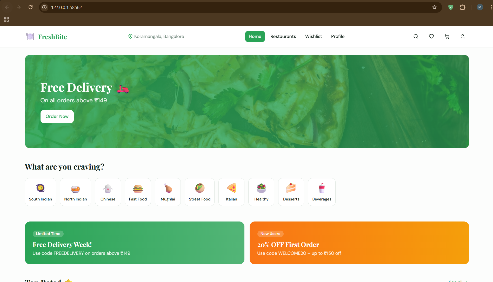
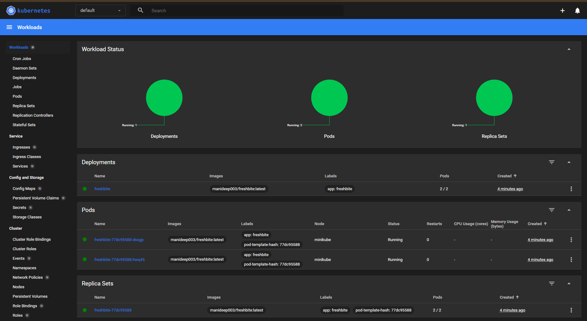

## Phase 5 – GitOps with Argo CD on AWS EKS
- Created minimal EKS cluster with eksctl (t3.small nodes, ap-south-1)
- Installed Argo CD in-cluster
- Created Application synced to GitHub kubernetes/ path
- Auto-sync enabled → push change → Argo deploys to EKS

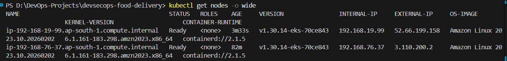
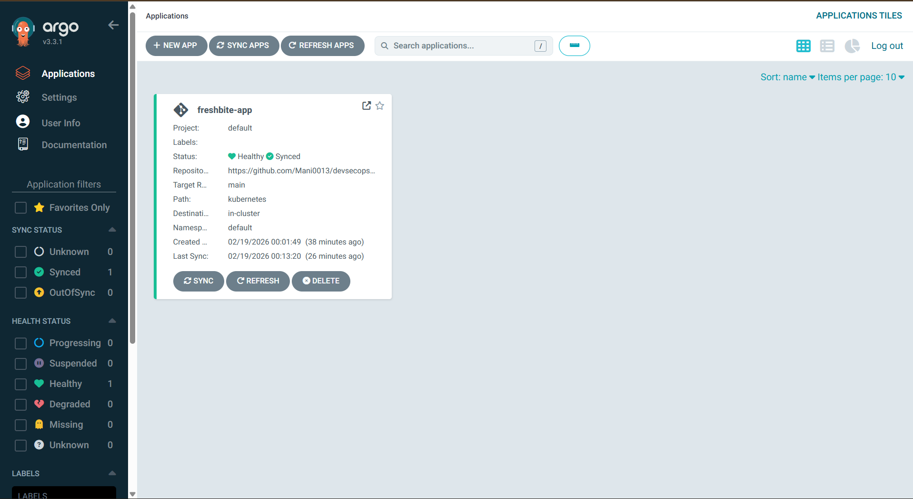
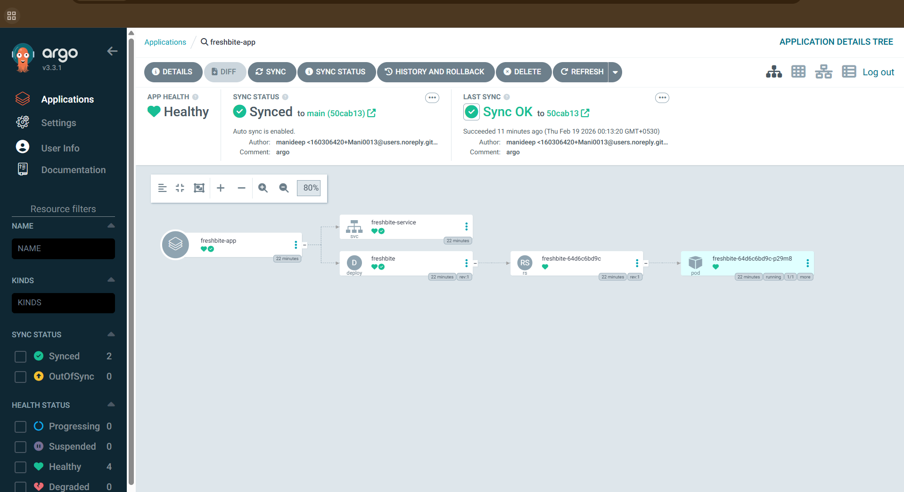

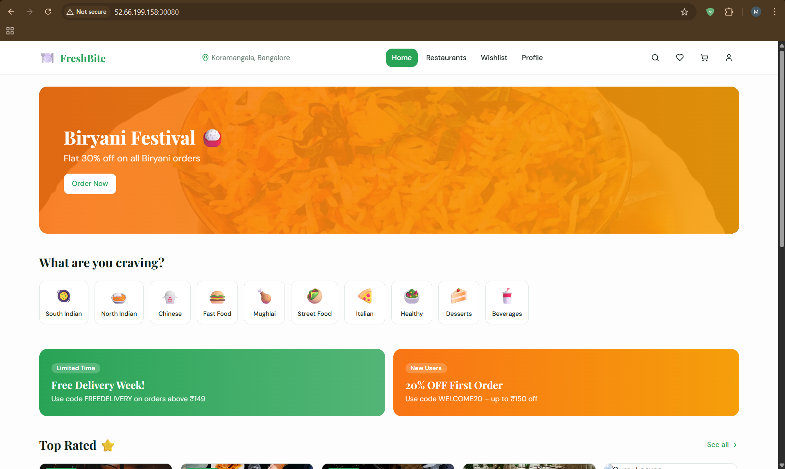
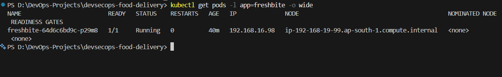

## Phase 6 – Monitoring with Prometheus + Grafana
- Installed kube-prometheus-stack via Helm in monitoring namespace
- Port-forward Grafana UI
- Imported dashboards: Node Exporter Full, Kubernetes Cluster Monitoring, Pod Metrics
- Verified real-time metrics for nodes, cluster, and FreshBite pod (CPU, memory, etc.)

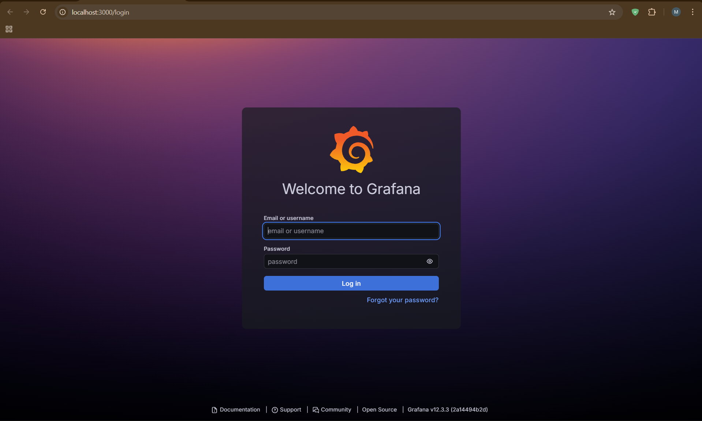
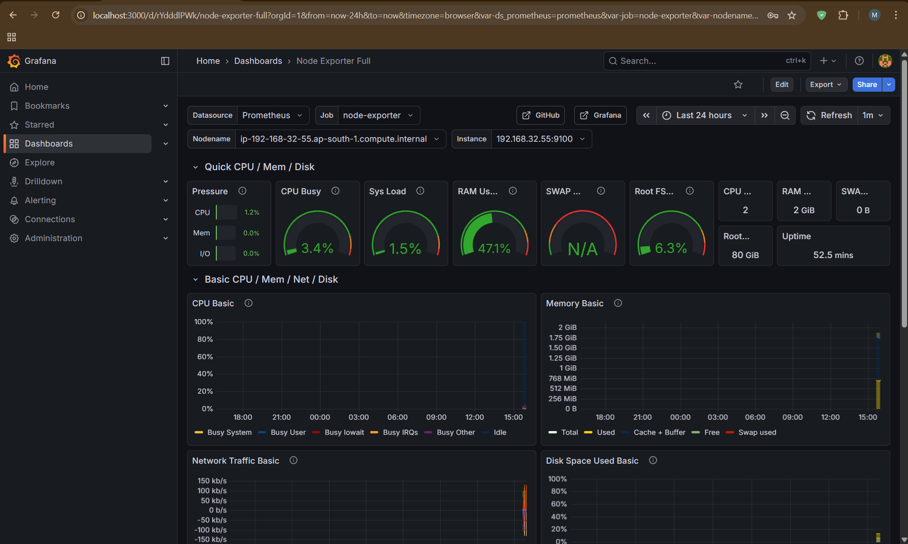
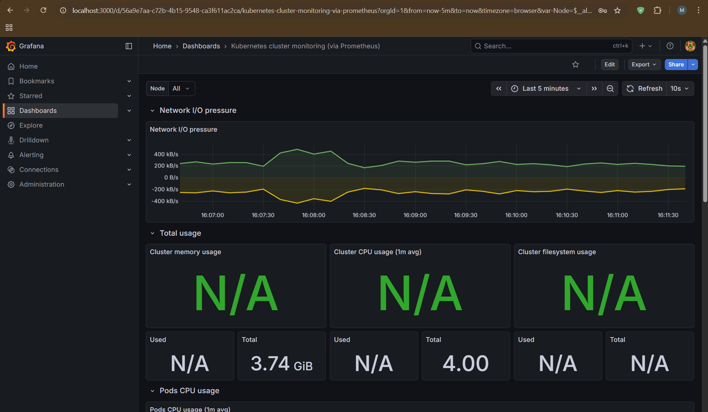
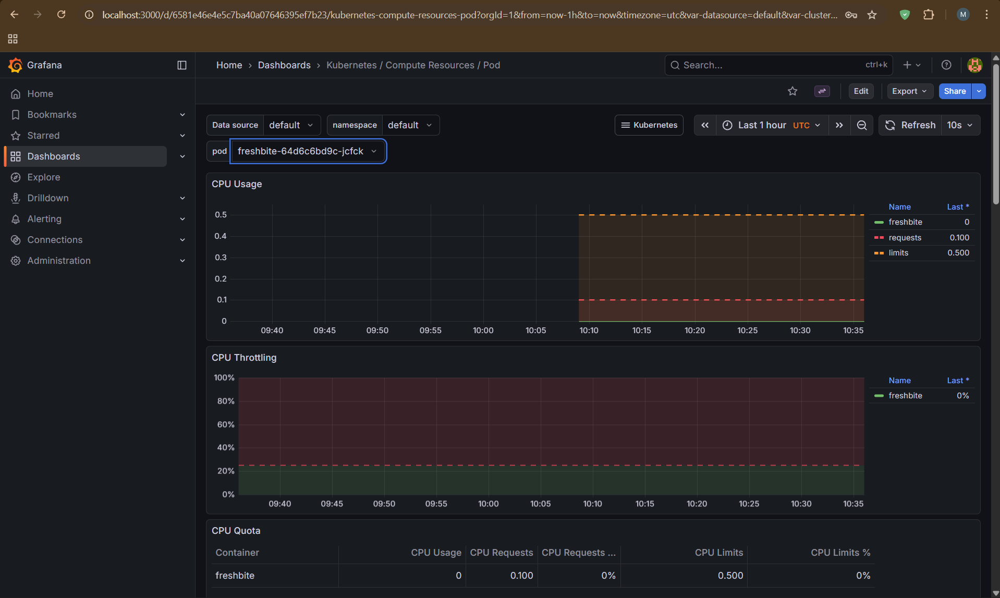

## Tech Stack Summary
- Frontend: Vite, React 18, TypeScript, Tailwind, shadcn/ui
- CI/CD: GitHub Actions, Docker Hub
- Security: SonarCloud, OWASP Dependency-Check, Trivy, Docker Scout
- Orchestration: Kubernetes, Minikube (local), AWS EKS (cloud)
- GitOps: Argo CD
- Monitoring: Prometheus, Grafana
